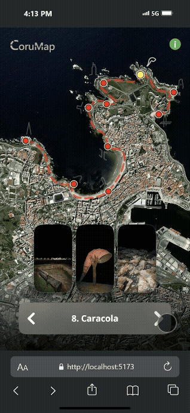
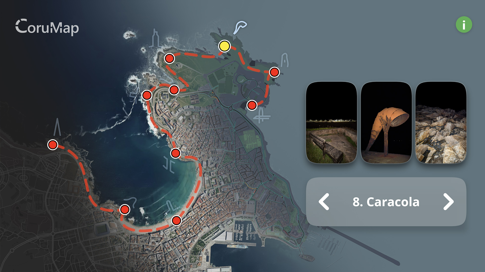

# 🗺️ CoruMap - Illustrated Map of the Coastline of A Coruña 

An immersive web application that takes you on a guided tour through A Coruña's stunning coastline. Navigate through 10 carefully selected locations, from the iconic Tower of Hercules to hidden gems like the Underground Columns, all accompanied by beautiful nighttime photography and smooth map animations.

---

### Table of Contents

- [Features](#features)
- [Screenshots](#screenshots)
- [Installation](#installation)
- [Usage](#usage)
- [Technologies](#technologies)
- [Project Structure](#project_structure)
- [Environment Setup](#environment_setup)
- [Future Enhancements](#future_enhancements)
- [License](#license)

---
<a id="features"></a>

## ✨ Features

- **Interactive Map Experience:**  
  - **Mapbox Integration:** High-quality satellite and 3 custom map styles with smooth transitions.
  - **10 Curated Locations:** Handpicked spots along A Coruña's coast including the Tower of Hercules, Riazor Viewpoint, and more.
  - **Animated Path Navigation:** Smooth curved path animations between locations.

- **Dynamic Visual Elements:**  
  - **Custom Markers:** Interactive markers with unique svg mini-logos for each location.
  - **Photo Gallery:** Three high-quality images per location with expandable views.
  - **Superellipse Geometry:** Uses mathematically perfect superellipse shapes instead of rounded rectangles, which are more pleasing to the human eye and create a more sophisticated visual experience.
  - **Universal Cohesive Design:** No matter the zoom level, resolution, or screen proportions, the experience remains intuitive and visually consistent. The entire app is built around this principle.

- **Smooth User Experience:**  
  - **Welcome Animation:** Choreographed introduction sequence of animations for page refreshes.
  - **Keyboard Navigation:** Arrow key support for quick location switching on PC.
  - **Touch Gestures:** Mobile-optimized touch interactions.
  - **Organic Animations:** Natural timing variations in animations for organic feeling.

- **Advanced Technical Features:**
  - **Pixel Ratio Management:** Automatic scaling for getting high resolution map backgrounds.
  - **Performance Optimizations:** Efficient rendering and memory management.
  - **Local Storage:** Remembers user preferences and status.

---
<a id="screenshots"></a>

## 📷 Screenshots

**App Usage in PC Example**
<p align="center">
    
</p>

**App Usage in Phone Example**
<p align="center">
    
</p>

**Different Map Options (change by pressing the CoruMap logo)**  
<p align="center">
    
</p>


---
<a id="installation"></a>

## Installation

1. **💾 Clone the repository:**

   ```sh
   git clone https://github.com/ferni2768/corumap.git
   ```

2. **📂 Navigate to the project directory:**

   ```sh
   cd corumap
   ```

3. **📦 Install dependencies:**

   ```sh
   npm install
   ```

4. **🔑 Set up environment variables:**

   Create a `.env` file in the root directory:
   ```env
   VITE_GITHUB_CDN_BASE=https://cdn.jsdelivr.net/gh/ferni2768/corumap@main/
   VITE_MAPBOX_ACCESS_TOKEN=your_mapbox_token_here
   ```

   * More info about these environment variables in [Environment Setup](#environment_setup)

5. **▶️ Start the development server:**

   ```sh
   npm run dev
   ```

---
<a id="usage"></a>

## Usage

### Navigate the Coast

- **Arrow Keys:** Use left/right arrow keys to move between locations
- **Click Markers:** Click any red marker to jump directly to that location
- **Touch Navigation:** Use the navigation buttons in the location card

### Explore Photos

- **View Gallery:** Each location displays three curated photos
- **Expand Images:** Click any image to view it in full screen
- **Auto-Updates:** Photos change automatically as you navigate

### Customize Experience

- **Map Styles:** Click the CoruMap logo to cycle through 3 different map styles: "Satellite", "Faded", and "Monochromatic"
- **Welcome Guide:** Click the info button (i) to revisit the welcome information

---
<a id="technologies"></a>

## 🤖 Technologies

- **React & TypeScript**: Modern, type-safe frontend development
- **Mapbox GL JS**: Professional mapping and geospatial visualization
- **JSDelivr CDN**: Fast, reliable content delivery network for serving static assets
- **React Superellipse**: Smooth geometric shapes for UI elements
- **Vite**: Lightning-fast build tool and development server
- **CSS3**: Advanced animations and responsive design

---
<a id="project_structure"></a>

## 🏗️ Project Structure

```
corumap/
├── public/                         # Static assets
│   ├── corumap_logo_long.svg       # Application logo
│   ├── favicon.ico                 # Browser icon
│   └── thumbnails/                 # Location photos
│       ├── location-1-image-1.jpg  # Organized by location and image
│       └── ...                     # 30 total images (3 per location)
├── src/
│   ├── components/
│   │   ├── MapContainer.tsx        # Main map and application logic
│   │   ├── Marker.tsx              # Interactive location markers
│   │   ├── AnimatedPath.tsx        # Smooth path animations
│   │   ├── Curve.tsx               # Bezier curve calculations
│   │   ├── Image.tsx               # Gallery Photo component
│   │   ├── RoundedCard.tsx         # Location information display
│   │   ├── WelcomeCard.tsx         # First-time user guide
│   │   ├── Logo.tsx                # Map style switcher and app logo
│   │   ├── MiniLogo.tsx            # Marker svg decorations
│   │   └── InfoButton.tsx          # Help information toggle
│   ├── styles/
│   │   ├── MapContainer.css        # Main layout and animations
│   │   ├── Marker.css              # Marker styling and effects
│   │   ├── AnimatedPath.css        # Path animation styles
│   │   └── ...                     # Individual component styles
│   ├── utils/
│   │   ├── pixelRatio.ts           # High-DPI display management
│   │   ├── mapStyleUtils.ts        # Map styling and configuration
│   │   └── imageUtils.ts           # Image handling utilities
│   ├── App.tsx                     # Application entry point
│   ├── main.tsx                    # React DOM rendering
│   └── vite-env.d.ts               # Vite type definitions
├── readme-images/                  # README documentation images
├── eslint.config.js                # Code linting configuration
└── package.json                    # Dependencies and scripts
```

---
<a id="environment_setup"></a>

## 🔧 Environment Setup

### Mapbox Token Setup

1. **Create a Mapbox Account:** Visit [mapbox.com](https://www.mapbox.com/) and sign up
2. **Generate Access Token:** Navigate to your account settings and create a new public token
3. **Configure Environment:** Add your token to the `.env` file:
   ```env
   VITE_MAPBOX_ACCESS_TOKEN=pk.your_actual_token_here
   ```

### GitHub CDN Setup (Optional)

For serving images via JSDelivr CDN from your GitHub repository:

1. **Upload Repository:** Ensure your project is pushed to a public GitHub repository
2. **Get CDN Base URL:** Use the JSDelivr format:
   ```env
   VITE_GITHUB_CDN_BASE=https://cdn.jsdelivr.net/gh/ferni2768/corumap@main/ferni2768/corumap@main/
   ```
3. **Configure CDN Environment Variable:**
   ```env
   VITE_GITHUB_CDN_BASE=https://cdn.jsdelivr.net/gh/ferni2768/corumap@main/
   ```

### Development Scripts

```bash
npm run dev      # Start development server
npm run build    # Build for production
npm run preview  # Preview production build
```

---
<a id="future_enhancements"></a>

## 🔮 Future Enhancements

- **Social Sharing:** Share specific locations
- **More Map Options:** Add more kinds of background Maps
- **Daytime Content:** Different photo sets for daytime
- **Accessibility:** Enhanced screen reader and keyboard navigation support
- **Multi-Language Support:** Add translations for Spanish and other languages

---
<a id="license"></a>

## 🔑 License

This project is licensed under the [MIT License](LICENSE).

---

## 📍 About A Coruña

A Coruña is a beautiful coastal city in Galicia, northwestern Spain. Known for its stunning Atlantic coastline, historic Tower of Hercules lighthouse (a UNESCO World Heritage Site), and vibrant maritime culture, the city offers breathtaking views and rich history. This application showcases just a small portion of the city's coastal beauty, captured during peaceful evening walks by the sea.

**Made with ❤️ for A Coruña**